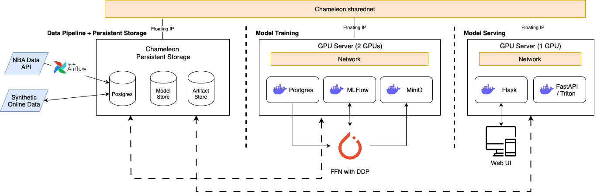

# NBA Stadium Attendance Prediction Using Game Intensity Predictions Approach
 
### Value Proposition
The goal of this project is to predict NBA stadiums' attendance that will be leveraged to increase audience attendance and to promote more exciting games. Currently, the NBA creates their schedule in advance, with preset deals with national television networks, as the non-ML approach. In very few cases, the league may “flex” games to change their scheduling, but this is done on an ad-hoc basis, with no clear defined metrics to change the scheduling. The status quo can create a problem during the season in which two teams who are unevenly matched may compete in primetime and nationally televised games, creating a gap in entertainment value. If we are able to capture the excitement of NBA games defined by the point difference, and analyze if we can predict attendance, we can provide more optimized insights to manage NBA fans and promotions..
 
### Contributors
 
| Name             | Responsible for                                                      | Link to their commits in this repo |
|------------------|----------------------------------------------------------------------|------------------------------------|
| All team members | Problem definition, setup, integration, continuous X (Units 1, 2, 3) |               [Commits](https://github.com/jasonmoon97/dynamic_nba_scheduling/commits/main/)                  |
| Will Calandra    | Model training (Units 4 + 5)                                         |               [Commits](https://github.com/jasonmoon97/dynamic_nba_scheduling/commits/main/?author=wcalandra5)                  |
| Lake Wang        | Model serving and monitoring (Units 6 + 7)                           |               [Commits](https://github.com/jasonmoon97/dynamic_nba_scheduling/commits/main/?author=Lake-Wang)                  |
| SungJoon Moon       | Data pipeline (Unit 8)                                               |               [Commits](https://github.com/jasonmoon97/dynamic_nba_scheduling/commits/main/?author=jasonmoon97)                  |
 
 
### System diagram

We provision and set up the infrastructure using infrastructure-as-code in the [devops] (./devops/), using python-chi.. First, we set up a shared Trovi Chameleon Jupyter environment to use python-chi. Then, using a [jupyter notebook](./devops/launch_persistent_stores.ipynb), we provision a compute instance in KVM@TACC, a persistent block storage, and a persistent object storage. Then, for the model training, we use [run_chameleon.py](./devops/run_chameleon.py) to launch a AMD GPU server on CHI@TACC.
 
### Summary of outside materials
|          | How it was created | Conditions of use |
|----------------------------------------------|------------------------------------------------------------------------------|-------------------|
|[nba_api](https://github.com/swar/nba_api)    | This is an API for nba.com, with the aim to make the NBA APIs easy to use.   | Since we are pitching this to be used by the NBA as an internal tool, we should be in compliance and have consent from the league. This is open source under the MIT License, we must not reproduce these materials for commercial purposes, and we should cite the NBA when using the statistics, as they own them. This is not permissible for gambling or fantasy sports. We will follow the NBA terms of use [Terms of Use](https://www.nba.com/termsofuse#nba-statistics). |
|[Pytorch](https://github.com/pytorch/pytorch) | This was created by the developers community                                 |    Open source, where generally, as long as we don’t generate or process inappropriate content, we are within the guidelines for use under the Linux Foundation.   |
|[WeatherAPI.com](https://www.weatherapi.com) | This is a weather data api provider, data provided in partnership with several data providers, government and metreological agencies.                                 |    We have a free trial to collect weather data. We can access, view and make copies of the data in the API for your personal or commercial use. We also credit WeatherAPI.com for providing the latitude and longitude conversion for the NBA stadiums. We follow the [Terms of Use](https://www.weatherapi.com/terms.aspx). |
|[Open-Meteo](https://open-meteo.com) | This is an open-source weather API that utilizes open-data weather forecasts provided by national weather services.                                  |    Open-meteo offers free access for non-commercial use. The terms of use are 1. less than 10,000 API calls per day, 5,000 per hour and 600 per minute, 2. may only use the free API services for non-commercial purposes, and 3. accept to the CC-BY 4.0 license. [Terms of Use](https://open-meteo.com/en/terms). |
 
 
### Summary of infrastructure requirements
| Requirement     | How many/when                                     | Justification |
|-----------------|---------------------------------------------------|---------------|
| `m1.medium` VMs | 2 for entire project duration    | We need a VM each for model training and model serving |
| 2 Nvidia A100 40GB GPUs (`liqid01 or 02`) | 3 hour block twice a week   | We plan to use DDP methods to optimize our training process, so we will need 2 GPU nodes. We think training for 3 hours should be enough for our model. We will use the second session for backup, freeing up resources for the rest of the class if we do not need it.    |
| Floating IPs    | 1 for entire project duration, 1 for sporadic use | We need to have a floating IP available for the persistent storage to communicate with VMs, and sporadic use when we train and serve the models on VMs. |
| Persistent Storage | 1 for entire project duration | We need the persistent storage for our data store, model store, and artifacts store to store the data and the model information persistently throughout the whole project duration. |
 
### Detailed design 
#### Data pipeline
We used object storage to persistently store the training and test data, as well as the synthetic data. The total size of the raw data is 78.1MB. Using NBA API and Weather API, we collected boxscore data, attendance data, as well as weather data for each game ID spanning from 2022-23 regular season to 2024-25 regular season. The code to collect data from API calls are organized in [data_engineering/extract_codes folder](./data_engineering/extract_codes). The samples are collected based on post-COVID19 seasons for more reliable estimate of the true data distributions, and we expect to collect more reliable data as more seasons pass. We also estimate that the NBA attendance and popularity is going to continuously increase, so the data used to model in this project will be a meaningful business application, especially if the popularity of certain teams continue to increase.
We saved the zipped file of the collected raw data to google drive, which will be used to [upload](./data_engineering/docker/docker-etl.yaml) the raw data to chameleon. We then transform the data to collect the moving 5 game average statistics and the season long moving average statistics right before the current game, and prepare that data for Model-Point Difference using [feature_engineering.py](./data_engineering/feature_engineering.py). We also combined the games with weather data for the current game date, and prepare that data for Model-Attendance Prediction. We split the data into training and test sets based on season. We train on 2022-23 and 2023-24 seasons, and test on 2024-25 season. The moving average until the current game and split by season prevents data leakage, especially providing information about the current game’s statistics and attendance. After this process, we loaded the data to our object store, and the total size of the persistent data in the object storage is 33.79MB with 14 objects. This include synthetic online data which will be discussed later.

#### Model training and training platforms
The modeling problem was two-fold: we would first use the features from the team dataset (shooting percentage, offensive efficiency, opponent defensive efficiency, etc.) to predict the “point differential” (model 1) that was expected in a game, with the belief that close games would drive more fans to the arena. We prevented a data leak in this scenario by pulling a rolling average of the last 5 games for each team (home team and opponent) as input to our model, with the output being the expected point differential relative to the home team (5 points for a 5-point win, -5 points for a 5-point loss). We then decided to pass this prediction to a second mode (model 2)l, along with weather data (temperature, wind, precipitation) to predict the attendance for a game as our final output. This would be used by the NBA to input an upcoming game, and see the predicted attendance for each game. Perhaps, the NBA could garner more interest in low expected attendance games by allocating more promotional materials to these games.
In both cases, we used a PyTorch MLP network to predict the output in a regression task given the inputs. We chose this model type for both problems given the expected nonlinear and complex relationships that we would be able to model easily, especially given the expected correlation between our features (team stats). We also wanted to explore optimizing the model through ONNX through serving, so we could feed the PyTorch model as an input. We struggled early to detect a signal in the data, so we spent a lot of time going back and forth on the features and lag that would be needed to achieve our goal. We ultimately found through our experiments that wider, deeper models performed well, especially after seeing many epochs of our data.
Our [training code](https://github.com/jasonmoon97/dynamic_nba_scheduling/blob/main/ml-train/train_model1.py) is shown here for the first model, with the second model following the same skeleton structure. We can see that we use MLFlow’s experiment tracking service (which is accessible through a Web UI) to log the metrics from our vanilla PyTorch training script, using the RMSE loss and the R^2 loss as our evaluation metrics. If we were to retrain this model, we would add a trigger in our model evaluation script that would tell us to re-train the PyTorch model, with expected added online data in our object storage.
We see in our [experiment tracking server](https://github.com/jasonmoon97/dynamic_nba_scheduling/tree/main/ml-train/results) that the large models perform best. From increasing the batch size, we also saw that we were able to increase the utilization of the GPU and reduce runtime. If we split across many workers however, we noticed that we had a big slowdown, as communication costs were high. We were also able to set up the Ray cluster and send jobs to it, although more work could be done to integrate it with the rest of the system in an automated CI/CD fashion.
 
#### Model serving and monitoring platforms
We use Fastapi to serve, the user will input game date, home team and away team, and we use these info to find relevant record in our mounted data, use the found team statistics features to run model1 to predict score_diff then combined with weather data as input to model2 and get final output of game attendance. (https://github.com/jasonmoon97/dynamic_nba_scheduling/tree/main/serving/website_frontend)
The requirement would be that users have to know the correct acronyms of NBA teams and an appropriate game date, as we have to retrieve the covariates from our storage to run inference on our model. 
The model optimizations (https://github.com/jasonmoon97/dynamic_nba_scheduling/tree/main/serving/measure_onnx) produces ONNX versions of model1 and model2, then on model2 performs different techniques like graph optimization and aggressive/conservative quantization. The ONNX versions show improvement over loading with .pth files, unfortunately due to resource constraint can’t verify the advanced optimizations on GPU sessions. 
For system optimizations (https://github.com/jasonmoon97/dynamic_nba_scheduling/tree/main/serving/system_serve), we have fastapi for both onnx and .pth models, have backend and frontend app.py, with model staging. 
Unfortunately due to development process and time constraints the offline evaluation and load testing wasn’t fully developed, the online evaluation with data drift detecting was implemented and discussed in later parts of the report. 
Define a business evaluation: with the predicted attendance the NBA can optimize their operation in multiple ways, for example improved dynamic pricing to boost attendance rate for unpopular games/generate more revenue on popular games. 
I tried multiple model serving options in the model serving part, unfortunately can’t have comprehensive performance comparisons.
Online evaluation is implemented (https://github.com/jasonmoon97/dynamic_nba_scheduling/tree/main/serving/online_eval) . In production we give real game data and AI generated games to evaluate model performance (response time, error range) and detect whether data drift has happened. Unfortunately due to the development process and time constraint the dashboarding and closing the loop isn’t fully implemented. 
We have monitored for data drift in (https://github.com/jasonmoon97/dynamic_nba_scheduling/blob/main/serving/online_eval/workspace/online_eval.ipynb) with the alibi package. The final few blocks aren’t optimized due to constraint. 
### Online data
The synthetic online is generated using gaussian noise to the actual data, and moving the date to the future by 3 years, using [generate_online.py](./data_engineering/generate_online.py). This is stored in the object storage, and is sent for inference after mounting to the inference virtual machine. 
 

